# Al-Fatir ( الفاطر )

**Your Complete Digital Islamic Companion**

Al-Fatir is a feature-rich Flutter application designed to bridge authentic Islamic resources with modern technology. From accurate prayer times and Qibla direction to an AI-powered Islamic assistant, Al-Fatir serves as a comprehensive guide for Muslims worldwide.

---

## ✨ Key Features

### 🕌 Prayer Times & Notifications
* **Location-Based Accuracy**: Calculates precise prayer times based on your specific country and city.
* **Smart Notifications**: Integrated local notifications ensure you never miss Fajr, Dhuhr, Asr, Maghrib, or Isha.
* **Offline Support**: Caches timings locally for access without internet.

### 📖 The Holy Quran
* **Multilingual Support**: Read the Quran with translations in **10 global languages**:
    * English, Urdu, Turkish, Bengali, Spanish, French, Indonesian, Russian, Swedish, and Chinese.
* **Optimized Rendering**: Smooth, scrollable reading experience powered by efficient JSON parsing.

### 📚 Extensive Hadith Library
* **17 Hadith Books**: Access a massive collection of prophetic traditions, including:
    * Sahih Al-Bukhari, Sahih Muslim, Jami` at-Tirmidhi, Sunan Abu Dawood, Sunan an-Nasa'i, Sunan Ibn Majah, Muwatta Malik, and more.

### 🤖 AI Chat Assistant (RAG)
* **Smart Knowledge Base**: A Retrieval-Augmented Generation (RAG) Chatbot capable of answering complex Islamic queries using authentic context.
* **Contextual Memory**: Remembers previous questions in the session for natural conversation flow.
* **Powered by Ollama**: Uses advanced local LLMs (Gemma/Llama) for privacy and speed.

### 🧭 Qibla Compass
* **Sensor Integration**: Uses device magnetometer and accelerometer for real-time accuracy.
* **Geospatial Precision**: Calculates direction based on exact user Longitude and Latitude.

### 🛠️ Islamic Utilities
* **Zakat Calculator**: Compute annual Zakat on Cash, Gold, Silver, and Investments.
* **Tasbeeh Counter**: Digital counter with custom presets and target goals.
* **Hijri Calendar**: Track Islamic dates and key events like Ramadan and Eid.
* **99 Names of Allah**: Beautiful visualization of Asma-ul-Husna with meanings.

---

## 🚀 Technical Highlights

This project showcases high-performance engineering patterns in Flutter:

* **Massive Data Handling**: Engineered to efficiently parse and render **over 100,000 lines of JSON data** locally, ensuring instant access to Quran and Hadith content without API latency.
* **Dynamic Widget Generation**: Utilizes advanced factory patterns and dynamic list generation to handle complex, heterogeneous content types smoothly.
* **Service-Oriented Architecture**: Clean separation between UI (Screens), Logic (Providers/Blocs), and Data (Services).

---

## 🏗️ Architecture & User Flow

### User Interaction Flow

```mermaid
graph TD
    Splash[Splash Screen] --> Home[Home Dashboard]
    
    subgraph "Core Modules"
        Home --> Quran[📖 Quran Reader]
        Home --> Hadith[📚 Hadith Library]
        Home --> Prayer[🕌 Prayer Times]
    end
    
    subgraph "AI & Tools"
        Home --> Chat[🤖 AI RAG Chatbot]
        Home --> Tools[🛠️ Tools: Zakat, Qibla, Tasbeeh]
        Home --> Hijri[📅 Hijri Calendar]
    end

    Chat -->|REST API Request| Backend[Python FastAPI Server]
    Backend -->|Context Retrieval| VectorDB[ChromaDB]
    Backend -->|Inference| LLM[Ollama Model]
    LLM -->|Response| Chat

```



---

## ⚙️ Installation & Setup Guide

To get the full experience (including the AI Chatbot), you need to set up the **Backend** first, then the **Flutter App**.

### Part 1: Backend Setup (RAG Chatbot)

The AI features require the separate RAG Chatbot server to be running.

1. **Clone the Chatbot Repository**:
```bash
git clone [https://github.com/daniyalsalman/rag_chatbot.git](https://github.com/daniyalsalman/rag_chatbot.git)
cd rag_chatbot

```


2. **Set up Python Environment**:
```bash
# Windows
python -m venv .venv
.venv\Scripts\activate

# Mac/Linux
python3 -m venv .venv
source .venv/bin/activate

```


3. **Install Dependencies**:
```bash
pip install -r requirements.txt

```


4. **Setup Ollama (Required for AI)**:
* Download and install [Ollama](https://ollama.ai/).
* Pull the required models:
```bash
ollama pull gemma3:1b
ollama pull nomic-embed-text

```


* Start the Ollama service: `ollama serve`


5. **Run the API Server**:
```bash
python api.py

```


*The server will start at `http://0.0.0.0:8000`. Keep this terminal open.*

### Part 2: Mobile App Setup (Flutter)

1. **Clone the Al-Fatir Repository**:
```bash
git clone [https://github.com/daniyalsalman/alfatir_flutter.git](https://github.com/daniyalsalman/alfatir_flutter.git)
cd alfatir_flutter

```


2. **Install Dependencies**:
```bash
flutter pub get

```


3. **Configure Network (Important)**:
* **Android Emulator**: The app is pre-configured to reach the backend at `http://10.0.2.2:8000`.
* **Real Device**: Update `lib/rag_chat_sreen.dart` with your PC's local IP address (e.g., `http://192.168.1.x:8000`).


4. **Run the App**:
```bash
flutter run

```


---

## 📱 Screenshots

| Home Dashboard | Quran Reader | AI Chatbot |
| --- | --- | --- |
|  |  |  |

| Prayer Times | 99 Names of Allah | Zakat Calc |
| --- | --- | --- |
|  |  |  |

| Hadith Reader | Hijri Calendar | Tasbeeh Counter |
| --- | --- | --- |
|  |  |  |

---

## 🤝 Contributing

Contributions are welcome!

1. Fork the Project
2. Create your Feature Branch (`git checkout -b feature/AmazingFeature`)
3. Commit your Changes (`git commit -m 'Add some AmazingFeature'`)
4. Push to the Branch (`git push origin feature/AmazingFeature`)
5. Open a Pull Request

---

## 📄 License

Distributed under the MIT License. See `LICENSE` for more information.

```

```
